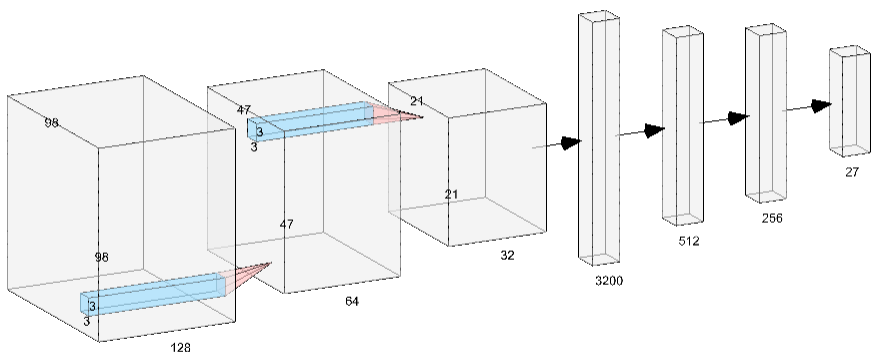

# PlantDiseaseClassification
* Building a CNN based classifier to classify regional plant diseases given the plant leaf image.  
* Load the trained weights in to the model to classify the input image. 
* Ensure the dimension of the image passed to the network is 100x100x3  
* You can modify all hyperparameters in main.py to trian from the scratch (i.e., With random initialization of Parameters)
# Dataset: Plant Village
Only a subset of classes (specific to the region) in the dataset were considered. 
# Architecture

# Outputs

