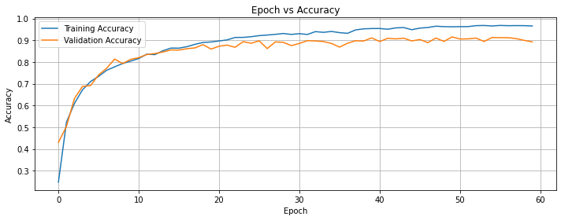
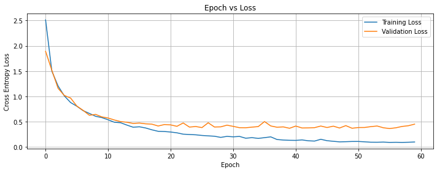

# Student Contributors
1. Akash KS
2. Bharathu Sivakumar
3. Harnitha

# PlantDiseaseClassification
* Building a CNN based classifier to classify regional plant diseases given the plant leaf image.  
* Load the trained weights in to the model to classify the input image. 
* Ensure the dimension of the image passed to the network is 100x100x3  
* You can modify all hyperparameters in main.py to trian from the scratch (i.e., With random initialization of Parameters)
# Dataset: Plant Village
Only a subset of classes (specific to the region) in the dataset were considered. 

* Link to download data (background subtracted) in pickle format
* [Download train data](https://drive.google.com/open?id=1m39rUu3pXP9HdE2mG0nblUQy1vHtMFM1) 
* [ Download train label](https://drive.google.com/open?id=1-RpptdCUReF-qrSGjt1_yeixF0BQQ22k)

# Architecture

# Outputs

